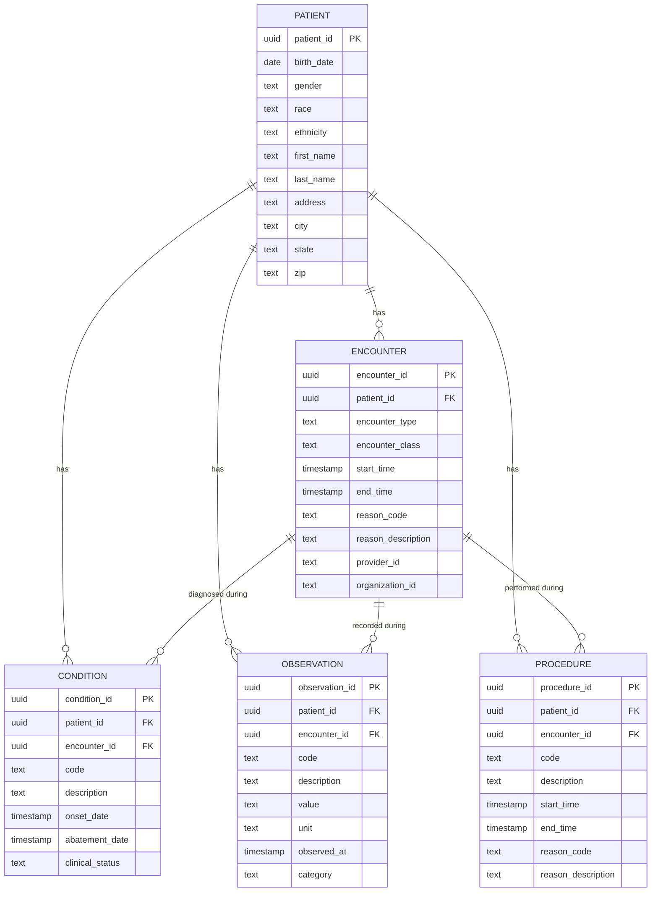

# EHR Pipeline — Database Schema

## How the tables relate

- **patient** is the anchor — every other table points back to it via `patient_id`.
- **encounter** is a visit. `condition`, `observation`, and `procedure` each optionally link to the specific encounter they happened during, in addition to the patient.
- A patient can have many encounters; each encounter can have many conditions, observations, and procedures tied to it.
